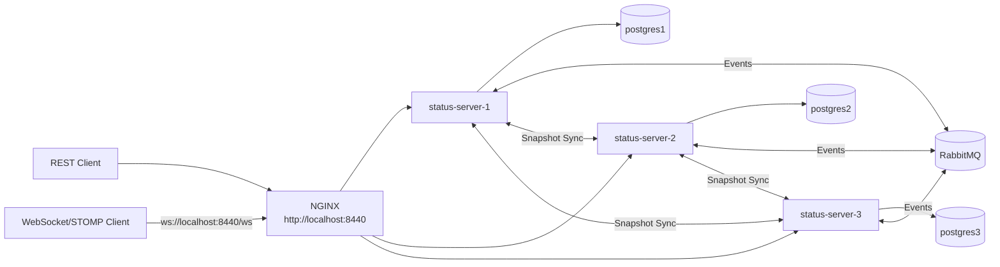

# Architektur

## Requestpfad

Clients senden REST-Requests an `http://localhost:8440`. WebSocket/STOMP-Clients verbinden sich mit `ws://localhost:8440/ws`. NGINX verteilt beide Verbindungsarten per `least_conn` auf eine erreichbare Statusserver-Node.

## Replikation

Eine Node speichert Schreibvorgänge lokal und veröffentlicht danach ein RabbitMQ-Event. Andere Nodes übernehmen fremde Events. Bei Konflikten gewinnt die neuere `uhrzeit`.

## WebSocket / STOMP

Statusänderungen werden zusätzlich an WebSocket-Clients gesendet:

- `/topic/status-feed` für Upserts
- `/topic/status-events` für Deletes

## Initialer Sync

Beim Start lädt eine Node per `/internal/status-sync/snapshot` den aktuellen Zustand von Peers. Währenddessen beantwortet sie öffentliche Status-Requests mit `503 Service Unavailable`.

## Ausfälle

- Node-Ausfall: NGINX routet auf verbleibende Nodes.
- Node-Neustart: Die Node synchronisiert sich per Snapshot.
- Gateway-Ausfall: Im Pflichtumfang nicht redundant.
