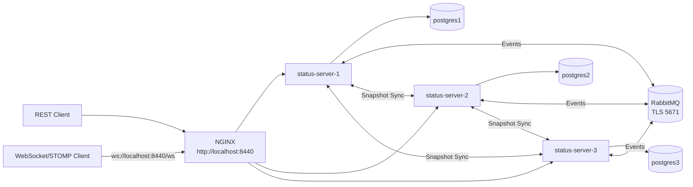

# Architektur

## Requestpfad

Clients senden REST-Requests an `http://localhost:8440`. WebSocket/STOMP-Clients verbinden sich mit `ws://localhost:8440/ws`. NGINX verteilt beide Verbindungsarten per `least_conn` auf eine erreichbare Statusserver-Node und terminiert nicht die interne Verbindung: zu den Nodes wird per HTTPS auf `8443` weitergeleitet.

## Replikation

Eine Node speichert Schreibvorgänge lokal und veröffentlicht danach ein RabbitMQ-Event. Andere Nodes übernehmen fremde Events und ignorieren eigene Echo-Nachrichten über die `sourceNodeId`.

Jede Node besitzt eine eigene transiente, auto-delete Queue. RabbitMQ puffert damit keine Events für offline Nodes. Fehlende Events werden beim Neustart über den Snapshot-Sync rekonstruiert.

Die Konfliktauflösung ist zeitstempelbasiert:

- Bei konkurrierenden Upserts gewinnt die neuere `uhrzeit`.
- Deletes werden als Tombstones mit Löschzeitpunkt gespeichert.
- Gleich alte oder ältere Upserts und Deletes werden ignoriert.
- Ein Upsert nach einem Tombstone ist nur gültig, wenn seine `uhrzeit` neuer als der Tombstone ist.

## WebSocket / STOMP

Statusänderungen werden zusätzlich an WebSocket-Clients derselben Node gesendet:

- `/topic/status-feed` für Upserts
- `/topic/status-events` für Deletes

## Initialer Sync

Beim Start lädt eine Node per `/internal/status-sync/snapshot` den aktuellen Zustand von Peers. Der Snapshot besteht aus aktuellen Statusmeldungen und Tombstones. Der Import verwendet dieselbe Konfliktlogik wie RabbitMQ-Replikation und löscht lokale Statusmeldungen nicht nur deshalb, weil sie in einem Peer-Snapshot fehlen.

Währenddessen beantwortet die Node öffentliche `/api/status/**`-Requests mit `503 Service Unavailable`; interne Sync-Endpunkte bleiben erreichbar. Bei `APP_BOOTSTRAP_REQUIRE_PEER=true` wartet die Node bis zu einem erfolgreichen Peer-Sync. Bei `false` wird sie nach dem Bootstrap-Timeout auch ohne Peer bereit.

## Ausfälle

- Node-Ausfall: NGINX routet auf verbleibende Nodes.
- Node-Neustart: Die Node synchronisiert sich per Snapshot.
- Gateway-Ausfall: Im Pflichtumfang nicht redundant.
